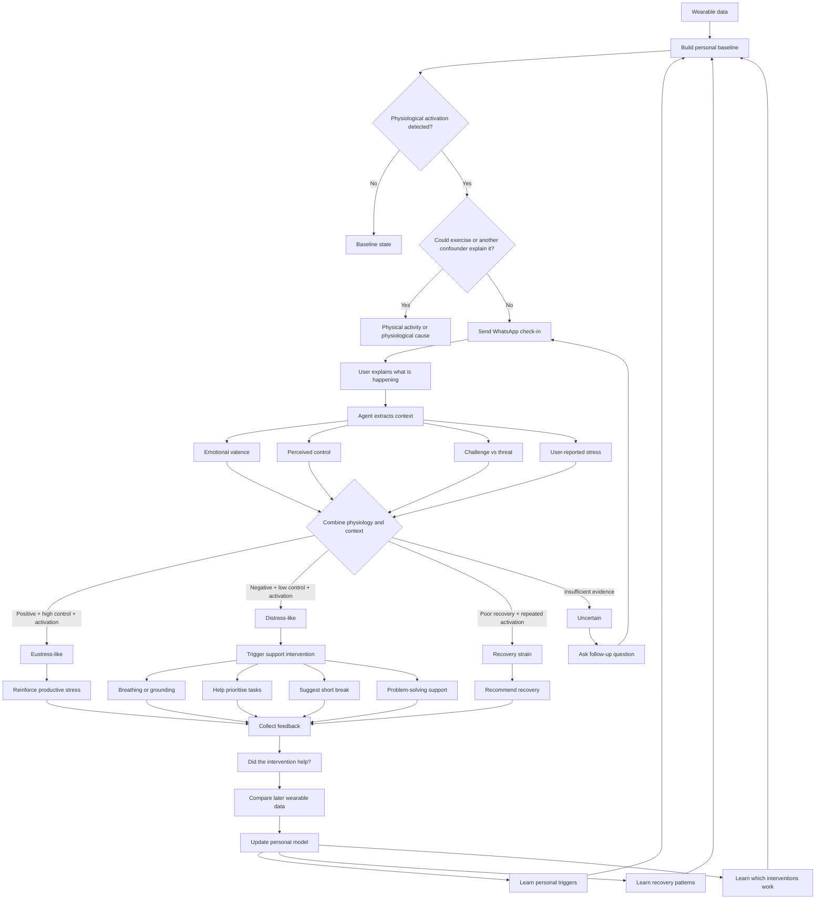

```mermaid
flowchart TD

A["Wearable data"] --> B["Build personal baseline"]
B --> C{"Physiological activation detected?"}

C -->|No| D["Baseline state"]
C -->|Yes| E{"Could exercise or another confounder explain it?"}

E -->|Yes| F["Physical activity or physiological cause"]
E -->|No| G["Send WhatsApp check-in"]

G --> H["User explains what is happening"]
H --> I["Agent extracts context"]

I --> J["Emotional valence"]
I --> K["Perceived control"]
I --> L["Challenge vs threat"]
I --> M["User-reported stress"]

J --> N{"Combine physiology and context"}
K --> N
L --> N
M --> N

N -->|"Positive + high control + activation"| O["Eustress-like"]
N -->|"Negative + low control + activation"| P["Distress-like"]
N -->|"Poor recovery + repeated activation"| Q["Recovery strain"]
N -->|"Insufficient evidence"| R["Uncertain"]

O --> S["Reinforce productive stress"]
P --> T["Trigger support intervention"]
Q --> U["Recommend recovery"]
R --> V["Ask follow-up question"]

T --> W["Breathing or grounding"]
T --> X["Help prioritise tasks"]
T --> Y["Suggest short break"]
T --> Z["Problem-solving support"]

S --> AA["Collect feedback"]
W --> AA
X --> AA
Y --> AA
Z --> AA
U --> AA
V --> G

AA --> AB["Did the intervention help?"]
AB --> AC["Compare later wearable data"]
AC --> AD["Update personal model"]

AD --> AE["Learn personal triggers"]
AD --> AF["Learn recovery patterns"]
AD --> AG["Learn which interventions work"]

AE --> B
AF --> B
AG --> B
```
