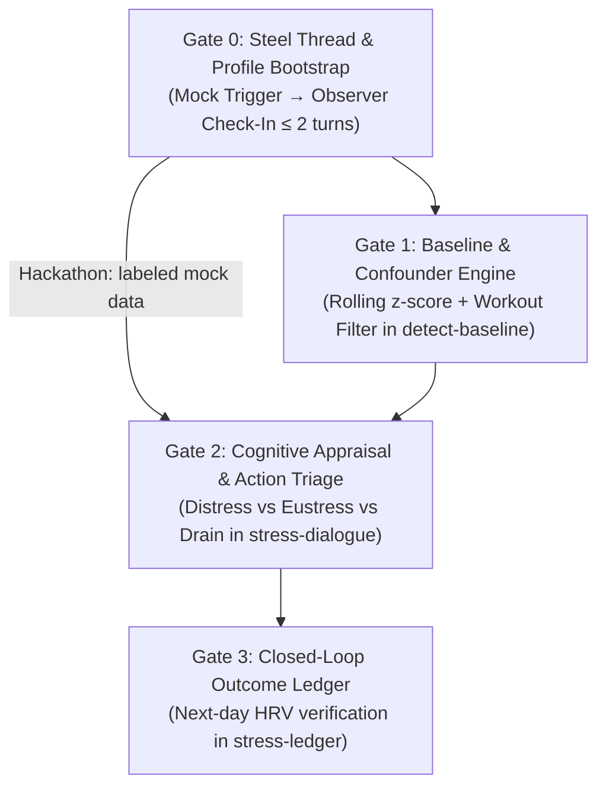

# Vertical Delivery Plan & Architecture Alignment

This document is the canonical **vertical delivery plan** for **The Overthinkers** on the **Hermes Agent**.

It draws on the architectural patterns, skill layout, profile hierarchy, and quality gates from [`pridiuksson/highlander-longevity-coach`](https://github.com/pridiuksson/highlander-longevity-coach). Reuse of those patterns does not establish the efficacy of this coaching workflow.

The core thesis follows the **80/20 delivery principle**: prioritize possible contributing explanations, one micro-action, and recorded follow-up, while deferring complex clinical psychodynamics (IFS parts mapping, imagery rescripting, real-time rumination state machines) to **Future Plans**. The 80/20 framing is a scope heuristic, not a measured outcome claim.

**Implementation status:** The profiles, skills, helpers, and tests below are planned deliverables. Existing repository validators do not establish that these components exist or work end to end.

---

## 1. Architectural Lineage from Highlander

The Overthinkers directly adopts the following core design invariants from Highlander:

1. **"Silence is free; speech is ledgered."**
   * The coach defaults to silence. Proactive outreach occurs at most **once per day**, strictly when an anomaly crosses threshold. Normal variance equals silence.
2. **"Compare against the person's own baseline, never a population norm."**
   * V1 uses directional deviations from a personal rolling baseline, never generic population averages. A z-score threshold is not a slope-break detector; trend detection is deferred.
3. **The Evidence & Confounder Interlock:**
   * Check data quality and potential confounders before conversational triage. Elevated workout load is a possible physical explanation, not proof of cause. Absence of a workout explanation does not establish psychological stress.
4. **Adversarial Restraint & Anti-Rumination Cap:**
   * Conversations are bounded to **2 agent messages in Gate 0 and 3 in Gate 2**, including the closing message. The agent explores a possible explanation, offers at most one micro-action, and exits. The cap is a product boundary, not a validated guarantee against rumination.
5. **Profile / Memory Rent Architecture:**
   * Three-tier separation: AI persona (`SOUL.md`), human baseline (`USER.md`), and living state (`MEMORY.md`).
6. **Hermes Skill Contract:**
   * Standardized skills under `skills/<name>/SKILL.md` with declarative YAML metadata, parameter injection via `config.yaml`, and independent helper scripts.

---

## 2. Profile Architecture (AI Mind vs. Human Biology vs. Memory)

Following the Highlander profile pattern, configuration is decoupled into three distinct tiers:

```text
Profile/
├── SOUL.md          # Tier 1: The AI's Mind (Persona, cadence, cognitive boundaries)
├── USER.md          # Tier 2: The Human's Context (Biometric sources, work/stress patterns)
└── MEMORY.md        # Tier 3: Living Memory (Observed associations, uncertainty)
```

### Tier 1: Canonical `SOUL.md` Personas (The AI's Mind)
Governs communication posture, pushback intensity, and boundary rules:
* **The Self-Distanced Observer (Default):** Calm, objective, analytical. Prompts the user to view their circumstances from a 3rd-person observer stance. Never engages in therapy, psychoanalysis, or open-ended emotional venting. Strictly caps conversations at 2–3 turns.
* **The Concise Operator (Optional Archetype):** Fast triage, mobile-first bullet points. Highly focused on operational priority: *"Is this in your control? Yes $\rightarrow$ pick 1 priority. No $\rightarrow$ down-regulate."*

### Tier 2: `USER.md` Scaffold (The Human's Context)
Durable facts that pay context rent every turn:
* Reference to biometric storage (`health.db` or baseline data source).
* Typical cognitive friction patterns (e.g., deadline paralysis, perfectionism, sleep delay).
* Physical training profile (Zone 2, strength days, typical strain levels) to ensure accurate confounder filtering.
* Notification channel & quiet hours window.

### Tier 3: `MEMORY.md` Working State (Observed Associations)
Strict rent rules apply (no raw metric dumps; audited for staleness):
* **Active Stressors:** Current high-bandwidth projects or ongoing friction points.
* **Intervention Observation History:** Tentative associations between actions, subjective feedback, and later readings. Retain observation count, date range, missing follow-ups, known confounders, and uncertainty. An isolated improvement is an observation, not an established habit or causal effect.
* **Standing Rules:** Personal constraints and communication preferences.

### Runtime Installation & Data Boundary
* Commit only generic `Profile/` templates. During Gate 0, an explicit bootstrap step installs the persona into Hermes' runtime `SOUL.md` and the context/memory scaffolds into its runtime memory directory, after checking the installed Hermes version's supported paths.
* Preview target paths, back up existing runtime files, and preserve personalized content. Re-running bootstrap must not overwrite user context or memory.
* Install each self-contained skill into the configured Hermes skills directory and verify discovery with `hermes skills list`.
* Keep populated profiles, credentials, biometric storage, and the outcome ledger outside the Git checkout. Resolve paths from configuration; never copy personal runtime data back into templates.
* Gate 0 must verify that the installed persona and context are actually loaded; copying files alone is insufficient.

---

## 3. Skills Matrix & Hermes Conventions

Skills live under `skills/<name>/SKILL.md` and comply with the Hermes skill validator (`python3 scripts/validate-skills.py .`):

```text
skills/
├── detect-baseline/      # Stage 1: Ingest, rolling z-score, workout confounder filter
├── stress-dialogue/      # Stage 2: 3rd-person check-in, cognitive appraisal, 1 micro-action
└── stress-ledger/        # Stage 3: Outcome recording, next-day biometric closure, reflection
```

### Frontmatter Contract
Every skill declares its dependencies, execution platforms, and configurable parameters:
```yaml
---
name: stress-dialogue
description: "Executes a self-distanced check-in and cognitive appraisal when an anomaly is detected."
version: 1.0.0
author: Hermes Agent
license: MIT
platforms: [linux, darwin]
metadata:
  hermes:
    config:
      - key: stress.max_turns
        description: "Hard cap on conversational turns to prevent rumination"
        default: "3"
      - key: stress.allowed_hours
        description: "Local time window when proactive pings are allowed"
        default: "08:00-21:00"
    tags: [stress, appraisal, coaching]
---
```

---

## 4. Vertical Ship Gates (The 80/20 Delivery Plan)

Each gate is a self-contained, testable vertical slice delivering end-to-end functionality from trigger to action.

**Hackathon delivery order:** Gate 0, then a simplified Gate 2 driven by explicitly labeled mock data, plus minimal outcome recording. Demonstrate trigger → short conversation → one optional action → recorded follow-up. Gate 1 and automated Gate 3 follow after this path works; simulated readings must never be presented as actual wearable measurements.



---

### Gate 0: Steel Thread & Profile Bootstrap
> **Goal:** Validate end-to-end messaging flow, profile loading, and 3rd-person observer framing over the messaging channel.

* **What Ships:**
  * Initial `Profile/` templates: `SOUL.md` (Observer), `USER.md` (scaffold), `MEMORY.md`.
  * Mock anomaly trigger script (`scripts/simulate_trigger.py`).
  * One initial channel: **Telegram**. Additional channels are deferred. Bind replies to the intended user/session; do not accept unrelated chat messages as responses.
  * Durable event/session IDs deduplicate triggers and replies across restarts. Dispatch state must prevent uncertain delivery from being automatically resent; record it for inspection instead.
  * Outbound check-in using self-distanced observer framing:
    > *"Demo check-in using simulated data. Looking at your day from the outside, what's taking up your bandwidth?"*
  * User reply capture, concise acknowledgment, and immediate session termination ($\le 2$ turns).
  * **Turn contract:** One turn means one outbound agent message, including the close. Gate 0 sends the opening and, if the user replies, one acknowledgment. Retries and multipart sends must not bypass the message budget.
  * **No reply:** Expire the session after a configurable timeout (default: 24 hours), without a reminder. Late replies must not reopen the expired automated session.
* **Highlander Pattern Adopted:** Strict anti-verbosity ceiling; single-question intake; conversation hard-stop.
* **Ship / Acceptance Criteria:**
  * [ ] Mock trigger sends one labeled check-in through Telegram; the intended user's reply is captured and logged.
  * [ ] Runtime profiles load correctly; repeat bootstrap preserves existing personal content.
  * [ ] Repeated trigger/reply IDs and restart fixtures do not send duplicate check-ins or acknowledgments.
  * [ ] Missing replies expire silently; late and unrelated replies are handled without reopening the session.
  * [ ] Agent uses 3rd-person observer framing without psychoanalyzing.
  * [ ] Conversation terminates in $\le 2$ turns.
  * [ ] `./scripts/leak-scan.sh .` passes with zero violations.

---

### Gate 1: Rolling Baseline & Confounder Engine (`skills/detect-baseline`)
> **Goal:** Detect authentic autonomic anomalies while filtering out athletic exertion and respecting silence-by-default.

* **What Ships:**
  * `skills/detect-baseline/SKILL.md` + calculation helper `scripts/baseline_math.py`.
  * **Rolling Baseline Engine (initial testable heuristic):** For each metric, use up to 28 calendar days preceding the candidate night, excluding that night. Require at least 14 valid nightly readings from the same source and measurement definition. Compute sample mean and sample standard deviation, then `z = (candidate - mean) / standard_deviation`.
    * Flag low HRV at `z <= -1.5`, high resting HR at `z >= 1.5`, and high sleep fragmentation at `z >= 1.5`. One eligible flagged metric creates one candidate event; simultaneous flags are bundled.
    * Missing or invalid candidate data, insufficient history, or zero baseline variance make that metric ineligible. Do not impute zeros or mix devices/units. If all metrics are ineligible, return `insufficient_data` and stay silent.
    * Thresholds are configurable starting hypotheses to evaluate with fixtures and pilot observations, not validated psychological-stress cutoffs. Slope-break detection is out of scope for v1.
  * **Workout Confounder Filter:** Cross-checks previous day's athletic load / strain.
    * Compare a single provider's daily load against its preceding 28-day load baseline, requiring 14 valid days. Initially treat load above `mean + 1.5 * sample_standard_deviation` as elevated; this is also a configurable heuristic.
    * If load is elevated, record `possible_physical_recovery`, suppress the automated psychological check-in, and avoid asserting a confirmed cause.
    * If load/history is unavailable or variance is zero, record `confounder_unknown` and stay silent for proactive v1; user-initiated dialogue remains available.
    * Otherwise dispatch a neutral anomaly check-in to Gate 2 with source, flags, and uncertainty. Do not label the user psychologically stressed from readings alone.
  * **Silence Default:** Maximum 1 check-in per day; zero alerts if metrics are within normal variance.
  * Enforce the daily limit durably using the configured IANA timezone and allowed notification hours, including after process restarts.
* **Highlander Pattern Adopted:** "Compare against own baseline, never population norm"; adversarial evidence filter.
* **Ship / Acceptance Criteria:**
  * [ ] Unit tests pass over 28-day synthetic biometric fixtures (`tests/test_baseline.py`).
  * [ ] Fixtures cover both deviation directions, threshold boundaries, exclusion of the candidate night, missing readings, short history, zero variance, and multiple simultaneous flags.
  * [ ] Workout strain fixture suppresses the psychological check-in cleanly.
  * [ ] Unknown workout load/history produces an explicit uncertain state and no proactive ping.
  * [ ] Daily deduplication and notification-hour checks survive restart and timezone date boundaries.
  * [ ] `python3 scripts/validate-skills.py .` passes for `detect-baseline`.

---

### Gate 2: Cognitive Appraisal & Action Triage (`skills/stress-dialogue`)
> **Goal:** Explore a possible contributing explanation and offer one optional, actionable micro-step when appropriate.

* **What Ships:**
  * `skills/stress-dialogue/SKILL.md` implementing the `Diagram.md` appraisal matrix.
  * 2–3 turn structured check-in:
    1. **Context Extraction:** User describes possible contributing factors (workload, conflict, health, uncertainty). Record these as user-reported explanations, not verified root causes.
    2. **Cognitive Appraisal:**
       * *Low Control / Threat (Distress):* Prescribe nervous system down-regulation (physiological sigh, 5-minute outdoor walk, box breathing).
       * *High Control / Challenge (Eustress):* Prescribe friction reduction (single-task priority focus, blocking distractions).
       * *Cumulative Drain (Exhaustion):* Prescribe boundary protection (evening shutdown anchor, sleep window defense).
       * *Uncertain / Mixed:* Ask at most one clarifying question within the existing budget, or close with uncertainty. Do not force a category or action when evidence is insufficient.
    3. **Micro-Action Commitment:** If appropriate, offer one action and allow the user to decline. Record acceptance only when explicitly confirmed; do not exceed the message cap to obtain confirmation.
  * **Three-message budget:** Opening/context question, optional clarification or action proposal, then concise close. The mock path clearly labels simulated readings. Do not infer emotional valence or control from biometrics alone.
* **Highlander Pattern Adopted:** Action-oriented micro-steps; zero walls of text; anti-rumination circuit breaker.
* **Ship / Acceptance Criteria:**
  * [ ] Labeled dialogue fixtures cover Distress, Eustress, Cumulative Drain, and Uncertain/Mixed; expected labels follow explicit user context.
  * [ ] Agent never exceeds 3 conversational turns.
  * [ ] Offers at most one concrete action, honors refusal, and never logs unconfirmed commitment.

---

### Gate 3: Closed-Loop Outcome Ledger & Personal Adaptation (`skills/stress-ledger`)
> **Goal:** Close the empirical loop by recording interventions and evaluating next-day biometric recovery.

* **What Ships:**
  * `skills/stress-ledger/SKILL.md` + `scripts/ledger.py` (adopting Highlander's `proactive-coach/scripts/ledger.py` CLI pattern):
    ```bash
    scripts/ledger.py add TRIGGER CAUSE INTERVENTION   # Records new check-in
    scripts/ledger.py verify --next-day                # Compares against subsequent night's HRV
    scripts/ledger.py report                           # Outputs recovery delta & stats
    scripts/ledger.py reflect                          # Summarizes tentative associations in runtime memory
    ```
  * Next-day morning cron compares HRV/sleep recovery:
    * Did HRV rebound back within $\mu \pm 1.0\sigma$?
    * Did sleep fragmentation resolve?
  * **Outcome contract:** Store event/session ID, timestamps and timezone, real/mock provenance, source/metric definition, pre-intervention values and baseline, user-reported possible explanation, appraisal uncertainty, proposed action, explicit acceptance/completion status, subjective feedback, and follow-up readings with confounders. Personal values belong only in the external runtime store.
  * **Follow-up matching:** Match the next local night's readings by date/source to the original event and its frozen pre-intervention baseline. Missing follow-up remains `pending`, then becomes `unavailable` after a configurable expiry (default: 48 hours); it is never counted as improvement. Re-running verification must not duplicate or overwrite observations incorrectly.
  * **Interpretation:** A rebound is a later observation, not evidence that the action caused recovery. Report subjective usefulness separately from biometric change; distinguish proposed, accepted, and completed actions.
  * **Memory Writeback:** Store tentative associations with observation count, date range, missing follow-ups, confounders, and uncertainty. Require at least five completed actions with matched follow-ups before aggregate habit summaries; this is a product reporting minimum, not statistical validation. Individual events remain observations, and summaries must not claim efficacy or comparative superiority.
* **Highlander Pattern Adopted:** Outcome ledger CLI; automated reflection; writeback to persistent memory.
* **Ship / Acceptance Criteria:**
  * [ ] `ledger.py` records and resolves entries without data loss.
  * [ ] Next-day verification accurately calculates biometric rebound delta.
  * [ ] Fixtures verify date/source matching, frozen baselines, missing follow-ups, idempotent writes, and separation of mock and real records.
  * [ ] Memory summaries include counts and uncertainty, obey the minimum reporting rule, and contain no causal efficacy claims.

---

## 5. Pre-Push Quality & Leak Gates

Following Highlander's contributor workflow, all code and documentation must pass three automated gates before push or PR:

```bash
# 1. Identity, credentials, and raw health data leak scan
./scripts/leak-scan.sh .

# 2. Skill structural and frontmatter integrity verification
python3 scripts/validate-skills.py .

# 3. Git whitespace and formatting check
git diff --check
```

* **Zero raw health measurements:** Commit only redacted or descriptive values (`<value>`, `<YOUR_RESTING_HR_BPM>`).
* **Zero secrets or paths:** Never commit tokens, emails, or absolute host paths.

---

## 6. Future Plans (Deferred Scope — The 80% Complexity)

These modules represent deep clinical psychotherapy, advanced biosensing, and multi-modal integrations. They are deferred until Gates 0–3 are fully proven in production.

```mermaid
flowchart LR
    subgraph Phase2["Phase 2: Deep Psychodynamics"]
        P2A["IFS Parts Taxonomy<br/>(Managers, Firefighters, Exiles)"]
        P2B["Two-Chair Dialogue Protocol"]
        P2C["Imagery Rescripting Protocol"]
    end

    subgraph Phase3["Phase 3: Real-Time Guardrails"]
        P3A["Linguistic Immersion Detector"]
        P3B["Automated Venting Circuit Breaker"]
        P3C["Acoustic Affect & Voice Analysis"]
    end

    subgraph Phase4["Phase 4: Advanced Biosignals"]
        P4A["Continuous Intraday EDA Streaming"]
        P4B["Normative Population Centile Charts"]
        P4C["Automated Wearable Cloud Sync (Oura/Whoop)"]
    end

    Phase2 --> Phase3 --> Phase4
```



### 6.1 Phase 2: In-Depth Clinical Psychodynamics (IFS & Schema Mode)
* **IFS Parts Identification:**
  * Dissecting coping strategies into *Managers* (overthinking, perfectionism) and *Firefighters* (numbing, impulsive behaviors).
  * Tracing protective reactions down to the *Exile* (unmet emotional vulnerability).
* **Structured Two-Chair Dialogue:**
  * Guided conversational switching between the internal critic / demanding parent voice and the vulnerable felt self.
* **Imagery Rescripting:**
  * Structured visualization where the "healthy adult" persona intervenes in the memory scene of the stressor to provide the missing resource.

### 6.2 Phase 3: Real-Time NLP Guardrails & Rumination Interlocks
* **Dynamic Linguistic Immersion Detector:**
  * Real-time NLP classifier tracking pronoun ratios (1st person vs. 3rd person), cyclic sentence structures, and emotional flooding.
  * Automated conversational interlock: interrupts venting and forces a grounding pause if immersion scores spike.
* **Voice & Tone Telemetry:**
  * Analyzes vocal audio notes over messaging channels for acoustic stress markers (fundamental frequency jitter, pitch variability, speech tempo).

### 6.3 Phase 4: Advanced Biosensing & Normative Modeling
* **Normative Population Centiles:**
  * Stratified normative modeling (Marquand et al.) adjusting for age, biological sex, and long-term fitness drift.
* **Continuous Intraday EDA & Thermal Dynamics:**
  * Real-time sympathetic nervous system arousal detection via Electrodermal Activity (EDA) and skin temperature flux.
* **Automated Direct Multi-Provider OAuth Sync:**
  * Native cloud sync daemons for Oura Ring, Whoop 4.0, Garmin Connect, and Apple HealthKit.
