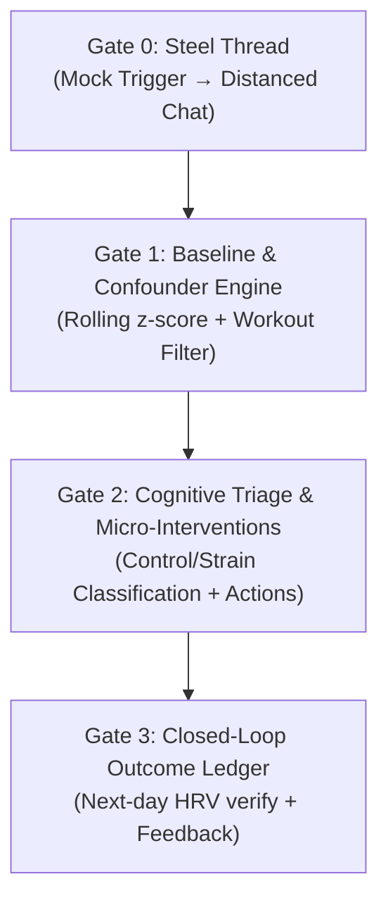

# Vertical Delivery Plan & Architecture Alignment

This document outlines the **vertical delivery plan** for **The Overthinkers** system running on the **Hermes Agent**.

The design follows the **80/20 principle**: deliver 80% of the practical user value (connecting physiological anomalies to causal attribution, quick action, and closed-loop validation) with 20% of the implementation effort, while preserving safety and data integrity.

Advanced psychotherapeutic mechanics (IFS parts mapping, imagery rescripting, real-time rumination state machines) are deferred to **Future Plans** at the bottom of this document.

---

## 1. Guiding Principles & Scope Alignment

### The 80/20 Rule: Behavioral Coaching over Clinical Therapy
* **From `Diagram.md`:** Adopt the pragmatic cognitive appraisal framework (perceived control, challenge vs. threat, tactical micro-interventions). It provides high-utility, immediate support without therapeutic friction or risk of emotional spiraling.
* **From `stress-dialogue-loop.md`:** Adopt the rigorous data mechanics (rolling baseline slope breaks, workout confounder exclusion, 3rd-person self-distanced entry, silence-by-default guardrails, and the next-day outcome ledger).
* **Deferred:** Deep intra-psychic roleplaying (exile discovery, two-chair critic battles, imagery rescripting). These are high-friction, error-prone over conversational messaging, and unnecessary for v1.

---

## 2. Vertical Ship Gates (Immediate Delivery)

Each gate represents a **fully functional vertical slice** across data, logic, dialogue, and storage that can be tested end-to-end and shipped incrementally.

---

### Gate 0: The "Steel Thread" (Mock Trigger & Distanced Check-In)
> **Goal:** Validate end-to-end agent communication and basic prompt framing over the messaging channel.

* **Scope (What Ships):**
  * Simulated/mock biometric anomaly trigger (CLI command or manual HTTP webhook).
  * Outbound Hermes check-in via messaging gateway (WhatsApp / Telegram / Matrix).
  * **Self-distancing prompt gate:** The agent asks the user to name the tension from an observer perspective (*"Biometrics show activation today. Looking at things from the outside, what's taking up your bandwidth?"*).
  * Single conversational reply acknowledgment and session close.
* **80/20 Leverage:** Confirms user engagement, channel routing, and prompt tone without depending on live health APIs.
* **Ship / DoD Criteria:**
  * [ ] Trigger script dispatches a single outbound message.
  * [ ] User response is captured and logged.
  * [ ] Guardrail check: session closes after at most 2 turns.

---

### Gate 1: Rolling Baseline & Confounder Engine
> **Goal:** Prevent false alarms by establishing individual baselines and filtering out physical exertion.

* **Scope (What Ships):**
  * Ingest nightly sleep and autonomic metrics: HRV (RMSSD), Resting Heart Rate (RHR), and Sleep Fragmentation.
  * **Individual Rolling Baseline:** Calculate 14–28 day rolling mean and standard deviation ($\mu \pm 1.5\sigma$). Detect triggers based on **slope breaks**, not population thresholds.
  * **Confounder Filter:** Cross-reference yesterday's physical activity load / workout strain.
    * If strain jumped significantly $\rightarrow$ Tag as *Physical Recovery Strain*, bypass psychological check-in, log recovery note.
    * If no physical confounder $\rightarrow$ Pass trigger to dialogue loop.
  * **Frequency Guardrail:** Maximum 1 proactive morning check-in per day; default to silence if inside normal variance.
* **80/20 Leverage:** Eliminates 70%+ of spurious alerts caused by gym sessions or temporary noise.
* **Ship / DoD Criteria:**
  * [ ] Unit tests verify slope break detection against mock 28-day time-series data.
  * [ ] High-strain workout days successfully suppress mental stress check-ins.
  * [ ] Hermes cron triggers only when an authentic anomaly occurs.

---

### Gate 2: Cognitive Appraisal & Action Triage
> **Goal:** Attribute the root cause and prescribe an immediate, actionable coping step.

* **Scope (What Ships):**
  * Hermes executes a 2–3 turn dialogue loop:
    1. **Identify Cause:** User names the friction (e.g., conflict with manager, looming deadline, physical sickness).
    2. **Classify Appraisal (`Diagram.md` model):**
       * *High Control / Challenge:* Eustress-like $\rightarrow$ Reinforce focus, assist in task prioritization or boundary setting.
       * *Low Control / Threat:* Distress-like $\rightarrow$ Recommend nervous system down-regulation (physiological sigh, 5-minute break, grounding).
       * *Chronic Drain:* Poor recovery accumulation $\rightarrow$ Recommend active rest and evening boundary protection.
    3. **Action Commitment:** Provide exactly 1 actionable micro-step (no walls of text).
* **80/20 Leverage:** Focuses on immediate, actionable clarity instead of open-ended rumination or heavy psychological diagnosis.
* **Ship / DoD Criteria:**
  * [ ] Agent accurately classifies user responses into High Control vs. Low Control vs. Recovery Drain.
  * [ ] Prompt strictly adheres to concise delivery ($\le 3$ conversational turns total).
  * [ ] Rumination prevention: conversations terminate gracefully without indefinite loops.

---

### Gate 3: Closed-Loop Outcome Ledger & Personal Model Update
> **Goal:** Close the feedback loop by verifying whether the intervention helped normalize the user's physiology.

* **Scope (What Ships):**
  * **Outcome Ledger:** Local SQLite / JSON store recording:
    `{ date, trigger_metric, deviation_sigma, attributed_cause, intervention_type, subjective_rating }`
  * **Next-Day Verification:** Morning cron inspects subsequent night's HRV/sleep data:
    * Did HRV rebound toward rolling mean?
    * Did sleep fragmentation decrease?
  * **Personal Model Adaptation:** Tag which intervention types correlate with biometric recovery for this specific user.
* **80/20 Leverage:** Provides empirical accountability—verifying that "help" translates into measurable physical recovery.
* **Ship / DoD Criteria:**
  * [ ] Outcome ledger records session metadata cleanly.
  * [ ] Next-day cron matches past interventions against fresh wearable readings.
  * [ ] Agent provides weekly 1-line trend recap (*"Taking a 5-min walk correlated with 15% better HRV recovery than task reprioritization"*).

---

## 3. Future Plans (Deferred Scope)

These modules represent deeper clinical complexity, richer multi-modal telemetry, and expanded platform integrations. They will be tackled iteratively once the core 80/20 loop is operational.

```mermaid
flowchart LR
    subgraph Phase2["Phase 2: Deep Psychodynamics"]
        P2A["IFS Parts Taxonomy<br/>(Managers, Firefighters, Exiles)"]
        P2B["Two-Chair Dialogue Protocol"]
        P2C["Imagery Rescripting Engine"]
    end

    subgraph Phase3["Phase 3: Real-Time Guardrails"]
        P3A["Multi-Turn Rumination Detector"]
        P3B["Linguistic Immersion Interlock"]
        P3C["Voice/Acoustic Affect Analysis"]
    end

    subgraph Phase4["Phase 4: Advanced Modeling & Telemetry"]
        P4A["Normative Centile Modeling"]
        P4B["Real-time EDA Stream Processing"]
        P4C["Cross-Platform Wearable Sync"]
    end

    Phase2 --> Phase3 --> Phase4
```

### 3.1 Phase 2: In-Depth Clinical Psychodynamics (IFS & Schema Mode)
* **IFS Parts Identification:**
  * Parsing coping strategies into *Managers* (overthinking, perfectionism) and *Firefighters* (numbing, distraction).
  * Guided dialogues to uncover the *Exile* (underlying vulnerability or fear) protected by the coping behavior.
* **Structured Two-Chair Dialogue:**
  * Guided roleplay: switching between the inner critic voice and the felt self with a compassionate adult tone.
* **Imagery Rescripting:**
  * Structured visualization where the "healthy adult" persona steps into the memory scene of the stressor to rewrite the outcome.

### 3.2 Phase 3: Real-Time Guardrails & Rumination Interlocks
* **Dynamic Linguistic Immersion Detector:**
  * NLP classifier monitoring 1st-person vs. 3rd-person pronouns, emotional flooding, and cyclic phrasing during active conversations.
  * Automated circuit breaker: halts venting and mandates a grounding re-centering step if immersion spikes.
* **Voice & Tone Telemetry:**
  * Analyze acoustic speech cues (pitch variability, speech rate) when using voice notes over WhatsApp or Matrix to detect sympathetic arousal directly.

### 3.3 Phase 4: Advanced Wearable Modeling & Telemetry
* **Normative Population Centiles:**
  * Multi-dimensional normative reference models (Marquand et al.) calibrating age- and demographic-adjusted variance.
* **Intraday Continuous EDA & Skin Temperature:**
  * Moving beyond nightly sleep bands to real-time sympathetic stress spikes detected via Electrodermal Activity (EDA).
* **Direct Multi-Provider OAuth Integrations:**
  * Direct cloud-to-cloud connectors for Oura Ring, Whoop 4.0, Garmin Connect, and Apple HealthKit with automated daily sync daemons.
