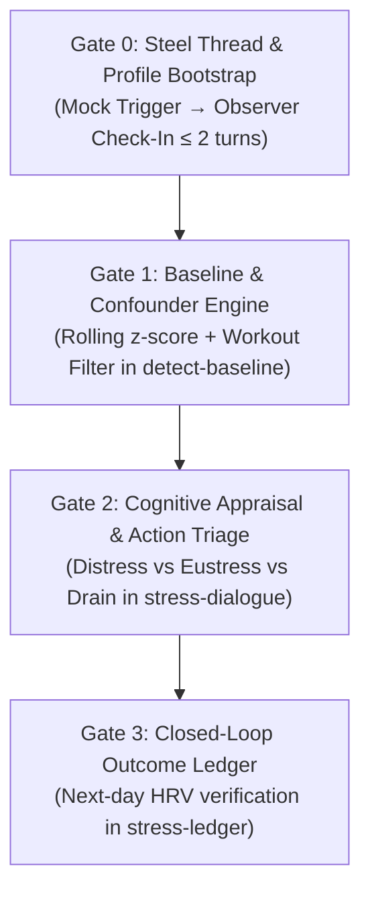

# Vertical Delivery Plan & Architecture Alignment

This document is the canonical **vertical delivery plan** for **The Overthinkers** on the **Hermes Agent**.

It adopts the proven architectural patterns, skill layout, profile hierarchy, and quality gates from [`pridiuksson/highlander-longevity-coach`](https://github.com/pridiuksson/highlander-longevity-coach).

The core thesis follows the **80/20 delivery principle**: ship 80% of real-world value (connecting wearable biometric drops to causal attribution, 1 micro-action, and closed-loop biometric verification) with 20% of the surface area, while deferring complex clinical psychodynamics (IFS parts mapping, imagery rescripting, real-time rumination state machines) to **Future Plans**.

---

## 1. Architectural Lineage from Highlander

The Overthinkers directly adopts the following core design invariants from Highlander:

1. **"Silence is free; speech is ledgered."**
   * The coach defaults to silence. Proactive outreach occurs at most **once per day**, strictly when an anomaly crosses threshold. Normal variance equals silence.
2. **"Compare against the person's own baseline, never a population norm."**
   * Triggers fire on personal slope breaks ($\mu \pm 1.5\sigma$ over a rolling 14–28 day window), never on generic population averages.
3. **The Evidence & Confounder Interlock:**
   * Nothing reaches conversational triage unverified. An autonomic drop explained by athletic exertion (strain/load jump) is tagged as physical fatigue and suppressed from psychological check-ins.
4. **Adversarial Restraint & Anti-Rumination Cap:**
   * Conversations are bounded to **$\le 2$ to $3$ turns maximum**. Open-ended venting is treated as a clinical hazard (rumination spiral); the agent clarifies the cause, prescribes one micro-action, and exits.
5. **Profile / Memory Rent Architecture:**
   * Three-tier separation: AI persona (`SOUL.md`), human baseline (`USER.md`), and living state (`MEMORY.md`).
6. **Hermes Skill Contract:**
   * Standardized skills under `skills/<name>/SKILL.md` with declarative YAML metadata, parameter injection via `config.yaml`, and independent helper scripts.

---

## 2. Profile Architecture (AI Mind vs. Human Biology vs. Memory)

Following the Highlander profile pattern, configuration is decoupled into three distinct tiers:

```text
Profile/
├── SOUL.md          # Tier 1: The AI's Mind (Persona, cadence, cognitive boundaries)
├── USER.md          # Tier 2: The Human's Context (Biometric sources, work/stress patterns)
└── MEMORY.md        # Tier 3: Living Memory (Intervention efficacy ledger, verified anchors)
```

### Tier 1: Canonical `SOUL.md` Personas (The AI's Mind)
Governs communication posture, pushback intensity, and boundary rules:
* **The Self-Distanced Observer (Default):** Calm, objective, analytical. Prompts the user to view their circumstances from a 3rd-person observer stance. Never engages in therapy, psychoanalysis, or open-ended emotional venting. Strictly caps conversations at 2–3 turns.
* **The Concise Operator (Optional Archetype):** Fast triage, mobile-first bullet points. Highly focused on operational priority: *"Is this in your control? Yes $\rightarrow$ pick 1 priority. No $\rightarrow$ down-regulate."*

### Tier 2: `USER.md` Scaffold (The Human's Context)
Durable facts that pay context rent every turn:
* Reference to biometric storage (`health.db` or baseline data source).
* Typical cognitive friction patterns (e.g., deadline paralysis, perfectionism, sleep delay).
* Physical training profile (Zone 2, strength days, typical strain levels) to ensure accurate confounder filtering.
* Notification channel & quiet hours window.

### Tier 3: `MEMORY.md` Working State (The Efficacy Ledger)
Strict rent rules apply (no raw metric dumps; audited for staleness):
* **Active Stressors:** Current high-bandwidth projects or ongoing friction points.
* **Intervention Efficacy History:** What micro-interventions actually normalized HRV for this user (e.g., *"15-min afternoon walk $\rightarrow$ +18% next-day HRV rebound; task reprioritization $\rightarrow$ neutral"*).
* **Standing Rules:** Personal constraints and communication preferences.

---

## 3. Skills Matrix & Hermes Conventions

Skills live under `skills/<name>/SKILL.md` and comply with the Hermes skill validator (`python3 scripts/validate-skills.py .`):

```text
skills/
├── detect-baseline/      # Stage 1: Ingest, rolling z-score, workout confounder filter
├── stress-dialogue/      # Stage 2: 3rd-person check-in, cognitive appraisal, 1 micro-action
└── stress-ledger/        # Stage 3: Outcome recording, next-day biometric closure, reflection
```

### Frontmatter Contract
Every skill declares its dependencies, execution platforms, and configurable parameters:
```yaml
---
name: stress-dialogue
description: "Executes a self-distanced check-in and cognitive appraisal when an anomaly is detected."
version: 1.0.0
author: Hermes Agent
license: MIT
platforms: [linux, darwin]
metadata:
  hermes:
    config:
      - key: stress.max_turns
        description: "Hard cap on conversational turns to prevent rumination"
        default: "3"
      - key: stress.quiet_hours
        description: "Time window when proactive pings are allowed"
        default: "08:00-21:00"
    tags: [stress, appraisal, coaching]
---
```

---

## 4. Vertical Ship Gates (The 80/20 Delivery Plan)

Each gate is a self-contained, testable vertical slice delivering end-to-end functionality from trigger to action.



---

### Gate 0: Steel Thread & Profile Bootstrap
> **Goal:** Validate end-to-end messaging flow, profile loading, and 3rd-person observer framing over the messaging channel.

* **What Ships:**
  * Initial `Profile/` templates: `SOUL.md` (Observer), `USER.md` (scaffold), `MEMORY.md`.
  * Mock anomaly trigger script (`scripts/simulate_trigger.py`).
  * Outbound check-in using self-distanced observer framing:
    > *"Morning. Biometrics show an autonomic dip. Looking at your day from the outside, what's taking up your bandwidth?"*
  * User reply capture, concise acknowledgment, and immediate session termination ($\le 2$ turns).
* **Highlander Pattern Adopted:** Strict anti-verbosity ceiling; single-question intake; conversation hard-stop.
* **Ship / Acceptance Criteria:**
  * [ ] Mock trigger successfully invokes Hermes via CLI or messaging gateway.
  * [ ] Agent uses 3rd-person observer framing without psychoanalyzing.
  * [ ] Conversation terminates in $\le 2$ turns.
  * [ ] `./scripts/leak-scan.sh .` passes with zero violations.

---

### Gate 1: Rolling Baseline & Confounder Engine (`skills/detect-baseline`)
> **Goal:** Detect authentic autonomic anomalies while filtering out athletic exertion and respecting silence-by-default.

* **What Ships:**
  * `skills/detect-baseline/SKILL.md` + calculation helper `scripts/baseline_math.py`.
  * **Rolling Baseline Engine:** Computes 14–28 day rolling mean and standard deviation ($\mu \pm 1.5\sigma$) on HRV (RMSSD), Resting HR, and Sleep Fragmentation. Triggers on slope breaks.
  * **Workout Confounder Filter:** Cross-checks previous day's athletic load / strain.
    * If strain jumped significantly $\rightarrow$ Tag as *Physical Fatigue*, log recovery status, stay silent.
    * If no workout confounder $\rightarrow$ Dispatches anomaly trigger to Gate 2.
  * **Silence Default:** Maximum 1 check-in per day; zero alerts if metrics are within normal variance.
* **Highlander Pattern Adopted:** "Compare against own baseline, never population norm"; adversarial evidence filter.
* **Ship / Acceptance Criteria:**
  * [ ] Unit tests pass over 28-day synthetic biometric fixtures (`tests/test_baseline.py`).
  * [ ] Workout strain fixture suppresses the psychological check-in cleanly.
  * [ ] `python3 scripts/validate-skills.py .` passes for `detect-baseline`.

---

### Gate 2: Cognitive Appraisal & Action Triage (`skills/stress-dialogue`)
> **Goal:** Rapidly attribute the root cause and prescribe exactly 1 actionable micro-intervention.

* **What Ships:**
  * `skills/stress-dialogue/SKILL.md` implementing the `Diagram.md` appraisal matrix.
  * 2–3 turn structured check-in:
    1. **Context Extraction:** User names the root cause (workload, conflict, health, uncertainty).
    2. **Cognitive Appraisal:**
       * *Low Control / Threat (Distress):* Prescribe nervous system down-regulation (physiological sigh, 5-minute outdoor walk, box breathing).
       * *High Control / Challenge (Eustress):* Prescribe friction reduction (single-task priority focus, blocking distractions).
       * *Cumulative Drain (Exhaustion):* Prescribe boundary protection (evening shutdown anchor, sleep window defense).
    3. **Micro-Action Commitment:** User confirms 1 micro-action; agent locks it in and exits.
* **Highlander Pattern Adopted:** Action-oriented micro-steps; zero walls of text; anti-rumination circuit breaker.
* **Ship / Acceptance Criteria:**
  * [ ] Accurate classification into Distress, Eustress, or Cumulative Drain across standard test cases.
  * [ ] Agent never exceeds 3 conversational turns.
  * [ ] Prescribes exactly 1 concrete action rather than an overwhelming list.

---

### Gate 3: Closed-Loop Outcome Ledger & Personal Adaptation (`skills/stress-ledger`)
> **Goal:** Close the empirical loop by recording interventions and evaluating next-day biometric recovery.

* **What Ships:**
  * `skills/stress-ledger/SKILL.md` + `scripts/ledger.py` (adopting Highlander's `proactive-coach/scripts/ledger.py` CLI pattern):
    ```bash
    scripts/ledger.py add TRIGGER CAUSE INTERVENTION   # Records new check-in
    scripts/ledger.py verify --next-day                # Compares against subsequent night's HRV
    scripts/ledger.py report                           # Outputs recovery delta & stats
    scripts/ledger.py reflect                          # Updates MEMORY.md with effective habits
    ```
  * Next-day morning cron compares HRV/sleep recovery:
    * Did HRV rebound back within $\mu \pm 1.0\sigma$?
    * Did sleep fragmentation resolve?
  * **Memory Writeback:** Updates `MEMORY.md` with verified correlations (*"Physiological sigh correlated with +14% HRV rebound for work deadlines"*).
* **Highlander Pattern Adopted:** Outcome ledger CLI; automated reflection; writeback to persistent memory.
* **Ship / Acceptance Criteria:**
  * [ ] `ledger.py` records and resolves entries without data loss.
  * [ ] Next-day verification accurately calculates biometric rebound delta.
  * [ ] Verified insights write back to `MEMORY.md` under the strict rent rule.

---

## 5. Pre-Push Quality & Leak Gates

Following Highlander's contributor workflow, all code and documentation must pass three automated gates before push or PR:

```bash
# 1. Identity, credentials, and raw health data leak scan
./scripts/leak-scan.sh .

# 2. Skill structural and frontmatter integrity verification
python3 scripts/validate-skills.py .

# 3. Git whitespace and formatting check
git diff --check
```

* **Zero raw health measurements:** Commit only redacted or descriptive values (`<value>`, `<YOUR_RESTING_HR_BPM>`).
* **Zero secrets or paths:** Never commit tokens, emails, or absolute host paths.

---

## 6. Future Plans (Deferred Scope — The 80% Complexity)

These modules represent deep clinical psychotherapy, advanced biosensing, and multi-modal integrations. They are deferred until Gates 0–3 are fully proven in production.

```mermaid
flowchart LR
    subgraph Phase2["Phase 2: Deep Psychodynamics"]
        P2A["IFS Parts Taxonomy<br/>(Managers, Firefighters, Exiles)"]
        P2B["Two-Chair Dialogue Protocol"]
        P2C["Imagery Rescripting Protocol"]
    end

    subgraph Phase3["Phase 3: Real-Time Guardrails"]
        P3A["Linguistic Immersion Detector"]
        P3B["Automated Venting Circuit Breaker"]
        P3C["Acoustic Affect & Voice Analysis"]
    end

    subgraph Phase4["Phase 4: Advanced Biosignals"]
        P4A["Continuous Intraday EDA Streaming"]
        P4B["Normative Population Centile Charts"]
        P4C["Automated Wearable Cloud Sync (Oura/Whoop)"]
    end

    Phase2 --> Phase3 --> Phase4
```



### 6.1 Phase 2: In-Depth Clinical Psychodynamics (IFS & Schema Mode)
* **IFS Parts Identification:**
  * Dissecting coping strategies into *Managers* (overthinking, perfectionism) and *Firefighters* (numbing, impulsive behaviors).
  * Tracing protective reactions down to the *Exile* (unmet emotional vulnerability).
* **Structured Two-Chair Dialogue:**
  * Guided conversational switching between the internal critic / demanding parent voice and the vulnerable felt self.
* **Imagery Rescripting:**
  * Structured visualization where the "healthy adult" persona intervenes in the memory scene of the stressor to provide the missing resource.

### 6.2 Phase 3: Real-Time NLP Guardrails & Rumination Interlocks
* **Dynamic Linguistic Immersion Detector:**
  * Real-time NLP classifier tracking pronoun ratios (1st person vs. 3rd person), cyclic sentence structures, and emotional flooding.
  * Automated conversational interlock: interrupts venting and forces a grounding pause if immersion scores spike.
* **Voice & Tone Telemetry:**
  * Analyzes vocal audio notes over messaging channels for acoustic stress markers (fundamental frequency jitter, pitch variability, speech tempo).

### 6.3 Phase 4: Advanced Biosensing & Normative Modeling
* **Normative Population Centiles:**
  * Stratified normative modeling (Marquand et al.) adjusting for age, biological sex, and long-term fitness drift.
* **Continuous Intraday EDA & Thermal Dynamics:**
  * Real-time sympathetic nervous system arousal detection via Electrodermal Activity (EDA) and skin temperature flux.
* **Automated Direct Multi-Provider OAuth Sync:**
  * Native cloud sync daemons for Oura Ring, Whoop 4.0, Garmin Connect, and Apple HealthKit.
