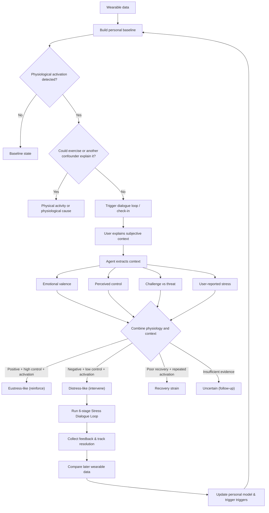

# The Overthinkers

> **Use wearable data and subjective experience to find the root cause of your stress.**

Wearables detect physiological stress signatures well (HRV drops, sleep fragmentation, autonomic troughs) but **cannot attribute cause**. A score is a number, not a reason. The same dip can mean: acute infection, overtraining, deadline crunch, or an unresolved interpersonal friction that occurred weeks ago and was never voiced.

**The Overthinkers** is the **meaning layer** between the biometric dashboard and the human: a structured, evidence-grounded dialogue loop running on the **Hermes Agent** that detects physiological activation, surfaces the actual cause through structured inner dialogue, and verifies the answer against the user's longitudinal data.

---

## Architecture & Core Loop



### The 6-Stage Stress Dialogue Loop

The loop is grounded in 5 clinical & cognitive frameworks:
1. **DETECT**: Physiological activation crosses individual rolling baseline (slope, not level).
2. **GROUND**: Self-distancing protocol (3rd person perspective gate to halt rumination).
3. **DIALOGUE**: Two-chair dialogue (critic voice ↔ felt self with compassionate tone).
4. **MAP**: IFS parts model (identifying protector/manager coping vs. underlying exile).
5. **RESCRIPT**: Imagery rescripting (healthy adult intervention).
6. **TRACK**: Post-dialogue re-scoring, emotional delta logging, and wearable normalization.

For the full specification and research backing, see [stress-dialogue-loop.md](./stress-dialogue-loop.md) and [Diagram.md](./Diagram.md).

---

## Deploying on a Cloud Box (Matrix OS)

The Hermes agent is a **stateful daemon** that requires continuous uptime for gateway messaging, scheduled cron loops for morning/evening check-ins, local memories, and skills.

The recommended, agent-executable way to provision a cloud computer is via **Matrix OS**:

👉 **[Box/Matrix/matrix-box-cookbook.md](./Box/Matrix/matrix-box-cookbook.md)**

Point your coding agent (Zed agent, Claude Code, Hermes, or Command Code) directly at that file. The agent will provision your Matrix OS computer, configure Hermes, install the necessary tools, and deploy a dedicated **Hermes Agent** app icon to your Matrix desktop.

For a full step-by-step walkthrough, see [ONBOARDING.md](./ONBOARDING.md).

---

## Directory Structure

```text
.
├── Box/
│   ├── README.md                     # Provider cookbook catalog
│   └── Matrix/
│       └── matrix-box-cookbook.md    # Agent-executable cookbook for Matrix OS
├── Diagram.md                        # Wearable data analysis & intervention flowchart
├── ONBOARDING.md                     # Step-by-step setup guide
├── README.md                         # Project overview
└── stress-dialogue-loop.md           # Research debrief and implementation specification
```

## License

MIT
