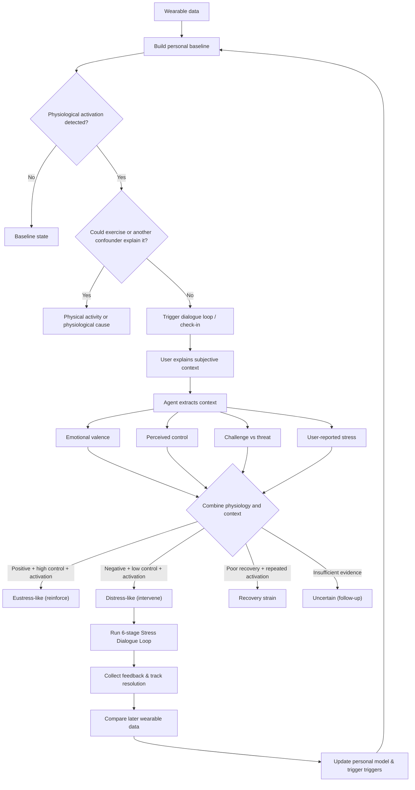

# The Overthinkers

> **Use wearable data and subjective experience to find the root cause of your stress.**

Wearables detect physiological stress signatures well (HRV drops, sleep fragmentation, autonomic troughs) but **cannot attribute cause**. A score is a number, not a reason. The same dip can mean: acute infection, overtraining, deadline crunch, or an unresolved interpersonal friction that occurred weeks ago and was never voiced.

**The Overthinkers** is the **meaning layer** between the biometric dashboard and the human: a structured, evidence-grounded dialogue loop running on the **Hermes Agent** that detects physiological activation, surfaces the actual cause through structured inner dialogue, and verifies the answer against the user's longitudinal data.

---

## Architecture & Core Loop



### The 80/20 Delivery Plan (Phase 1)

Following [`Plan/PLAN.md`](./Plan/PLAN.md), the system implements an 80/20 behavioral coaching framework across four vertical ship gates:

1. **Gate 0 (The Steel Thread)**: Simulated anomaly trigger, self-distanced 3rd-person observer check-in, user reply capture, and strict $\le 2$ turn session close.
2. **Gate 1 (Baseline & Confounder Engine)**: Ingests Samsung Health and Garmin Connect exports into SQLite, computes individual 28-day rolling baselines ($\mu \pm 1.5\sigma$), and suppresses alerts when prior-day athletic workout strain ($\ge 14.0$) explains the dip.
3. **Gate 2 (Cognitive Appraisal Triage)**: Attributes root friction into Eustress (High Control), Distress (Low Control), or Recovery Drain with an anti-rumination circuit breaker capped at $\le 3$ turns and exactly 1 tactical micro-action.
4. **Gate 3 (Closed-Loop Outcome Ledger)**: Evaluates next-day biometric rebound (HRV recovery and sleep fragmentation), updating `MEMORY.md` under context rent with verified habits ($N \ge 3$).

*Advanced clinical psychodynamics (IFS parts taxonomy, Two-chair critic roleplay, Imagery rescripting) are formally deferred to Phase 2.*

---

## Deploying on a Cloud Box (Matrix OS)

The Hermes agent is a **stateful daemon** that requires continuous uptime for gateway messaging, scheduled cron loops for morning check-ins, local memories, and skills.

The recommended, agent-executable way to provision a cloud computer is via **Matrix OS**:

👉 **[Box/Matrix/matrix-box-cookbook.md](./Box/Matrix/matrix-box-cookbook.md)**

* **Inference Model**: Google Gemini 3.8 Flash (`gemini-3.8-flash`) via Google AI Studio.
* **Audio Voice**: Native Gemini multimodal audio (`gemini-3.8-flash-tts`, voice `Kore`).
* **WhatsApp & Telegram Gateway**: 24/7 mobile coaching with instant voice transcription (STT) and voice note responses.
* **Live Desktop App**: Dedicated [Matrix OS Control Center](./Box/Matrix/app/) pinned to your Matrix desktop showing live telemetry, the outcome ledger, and interactive architectural explainers.

For a full step-by-step walkthrough, see [ONBOARDING.md](./ONBOARDING.md).

---

## Directory Structure

```text
.
├── .agents/
│   └── skills/                       # Zed agent developer skills (commit, create-pr, peer-review)
├── Box/
│   ├── README.md                     # Provider cookbook catalog
│   └── Matrix/
│       ├── matrix-box-cookbook.md    # Agent-executable cookbook for Matrix OS
│       └── app/                      # Matrix OS Control Center web application
├── ONBOARDING.md                     # Complete step-by-step setup and onboarding guide
├── Plan/
│   └── PLAN.md                       # Vertical delivery plan & 80/20 ship gates
├── Profile/
│   ├── SOUL.md                       # Tier 1: AI Persona (The Self-Distanced Observer)
│   ├── USER.md                       # Tier 2: Human context scaffold & baselines
│   └── MEMORY.md                     # Tier 3: Living efficacy ledger under context rent
├── README.md                         # Project overview
├── Research/
│   ├── Ieva Diagram.md               # Wearable data analysis & intervention flowchart
│   └── stress-dialogue-loop.md       # Research debrief and implementation specification
├── scripts/
│   ├── baseline_math.py              # CLI forwarder for rolling baseline & confounder checks
│   ├── ledger.py                     # CLI forwarder for outcome ledger & verification
│   ├── orchestrator.py               # Closed-loop orchestrator linking Gates 1, 2, and 3
│   ├── simulate_trigger.py           # Gate 0 steel thread mock trigger generator
│   ├── leak-scan.sh                  # Pre-push zero-leak PII/vitals gate
│   └── validate-skills.py            # Hermes skill structural validator
├── skills/                           # Hermes Agent domain skills
│   ├── detect-baseline/              # Rolling baseline and workout confounder engine
│   ├── stress-dialogue/              # Cognitive appraisal and micro-action triage
│   ├── stress-ledger/                # Outcome ledger and next-day rebound verification
│   ├── samsung-health-import/        # Samsung Health export archive parser
│   ├── garmin-import/                # Garmin Connect export archive parser
│   └── peer-review/                  # Hermes multi-agent review tool
└── tests/                            # Automated test suite (35 tests across Gates 0–3)
```

## License

MIT
