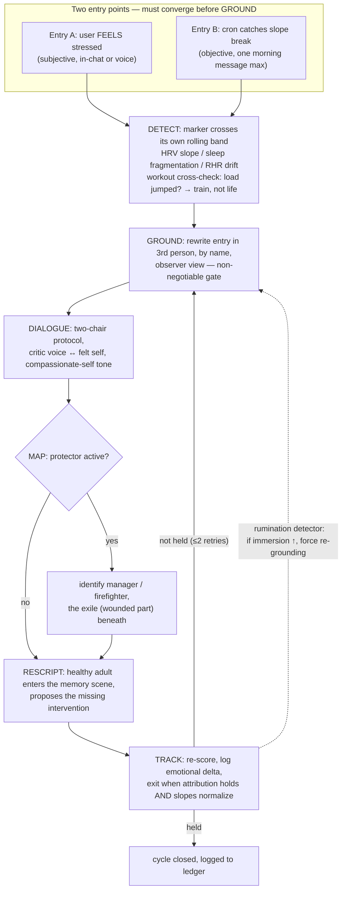

# Stress Dialogue Loop — Research Debrief & Implementation Spec
**Purpose:** a self-contained context document for an AI agent (or human) implementing this system in a fresh repo — a template repo like the `highlander-longevity-coach` pattern, running on a Hermes Agent host.
**Status:** research complete + pilot-spec written; implementation not yet started. The live demo page exists (`/home/ubuntu/inner-child-agentic-loop.html`, published via cloudflared quick tunnel).
**Written:** 2026-10-03, session `20261003_091416_a0e967c1`.
---
## 1. Source of Truth (SoT)
All claims below are re-derived from raw data or cited papers — **not** from memos or summaries. If a claim here disagrees with the underlying paper or DB, the paper/DB wins and this doc gets corrected.
### 1.1 The narrow problem this system solves
> **"I'm stressed. Why am I stressed?"**
Wearables detect stress signatures well (HRV dips, sleep fragmentation, autonomic troughs) but **cannot attribute cause**. A score is a number, not a reason. The same dip can mean: infection, overtraining, a deadline week, or a life event that changed three weeks ago and was never named out loud. Consequence: people optimize the wrong fix (extra rest day when the body needs a boundary; new mattress when the real issue is an unresolved conversation).
The system is the **missing meaning layer** between the biometric dashboard and the human: a structured, evidence-grounded dialogue loop that takes a physiological anomaly, surfaces the actual cause through inner dialogue, and verifies the answer against the user's own data.
### 1.2 Research backing — top 5 frameworks (each maps to one loop stage)
| # | Framework | Loop stage | Why it's in | Evidence grade |
|---|---|---|---|---|
| 1 | **Schema Therapy mode model** (Young; Lobbestael) | DETECT→MAP naming | Machine-encodable taxonomy of inner states; validated instrument (SMI) | validated self-report |
| 2 | **Self-distancing** (Kross, Ayduk, Grossmann) | GROUND | Strongest empirical base of the five; ERP/fMRI-verified; non-negotiable rumination interlock | strong (neuro + RCT) |
| 3 | **EFT two-chair + CFT tone** (Shahar; Gilbert) | DIALOGUE | Structured dialogue protocol; works only when felt from inside, not talked-about | pilot RCT + process research |
| 4 | **IFS parts model** (Schwartz) | MAP | Reads coping as protector → follows to the exile it guards; stress attributed to the wounded part, not the symptom | pilot-grade (map, not trial base) |
| 5 | **Imagery rescripting** (Arntz) | RESCRIPT | Strongest trial base among the change techniques | RCT (multicenter) |
**Normative-modeling grounding (the "why slopes work" theory):** Marquand et al., *Nature Protocols* 2022 + *Molecular Psychiatry* 2019 — diagnostic signal lives in **centile deviation from a reference frame**, not raw values. Bethlemamé et al., *Nature* 2022 (123,984-scan brain charts). Wearables agree: 435-participant study (PMC13487130, 2026) showed personalized deviation-from-own-baseline features **substantially outperform** population features for early detection (F1 0.78, ~5.5 days early). Full reference list with DOIs: §7.
### 1.3 The marker hierarchy (which vitals actually signal stress)
| Marker | What it signals | Evidence | Consumer-wearable? |
|---|---|---|---|
| HRV (RMSSD/SDNN) | primary autonomic marker; vagal tone drops under acute + chronic stress | Shaffer & Ginsberg 2017; Immanuel et al. 2023 scoping review | ✅ nightly |
| Sleep architecture (deep %, REM fragmentation, awakenings) | acute-stress signature: fragmentation first, trough ~4–6 wk later, restoration last; more sensitive than total sleep time | *Sleep* (Oxford) 2022 + our own audited data | ✅ |
| Resting HR | slow chronic marker; only interpretable as within-person trend (fitness drift dominates) | Immanuel 2023 | ✅ |
| EDA | sympathetic arousal in real time; strong lab validity, weak consumer availability | wearables-for-stress reviews 2023–24 | ⚠️ gap |
| Respiratory rate + skin temp | supporting nightly band markers | npj Digital Health 2026 | ✅ |
| Cortisol (hair/ambulatory) | gold standard for chronic stress | Univ. Birmingham review 2023 | ❌ not consumer — out of scope |
**The rule that makes it work: `DETECT fires on slope, not level.`** A trigger is a marker crossing **its own rolling band** (28-day mean ± σ), never a population threshold. Population centiles are allowed once, downstream, as severity context — never as the trigger. (This is the direct lesson from the normative-modeling research and it is also encoded in the host coach skill's rule: *"Compare against the person's own baseline, never a population norm."*)
### 1.4 What the loop is NOT
- Not therapy, not a diagnosis, not clinically validated — the public page says so and so must any derivative.
- Not a chatbot or mood journal — every stage has a check, exit is measured (attribution holds AND slopes normalize).
- Not a replacement for a coach loop — it plugs *between Verify and Decide* in an existing health-coach loop (Ingest → Verify → **[this loop]** → Decide → Plan → Deliver → Learn), inheriting the host's guardrails: adversarial review per insight, one message max, silence default, outcome ledger.
---
## 2. The Loop — 6 stages

… omitted 205 diff line(s) across 1 additional file(s)/section(s)
